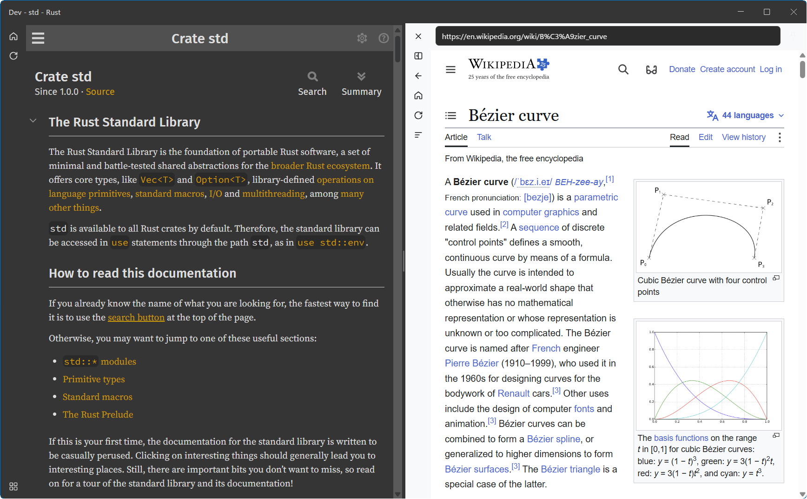
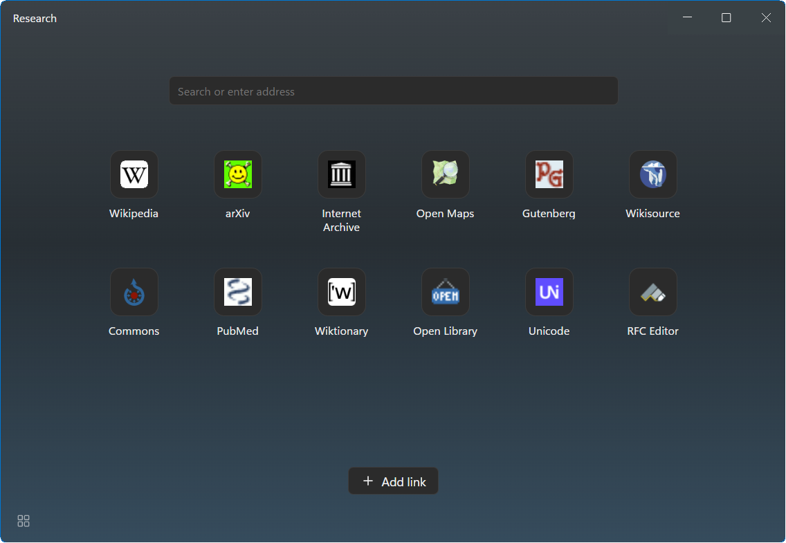
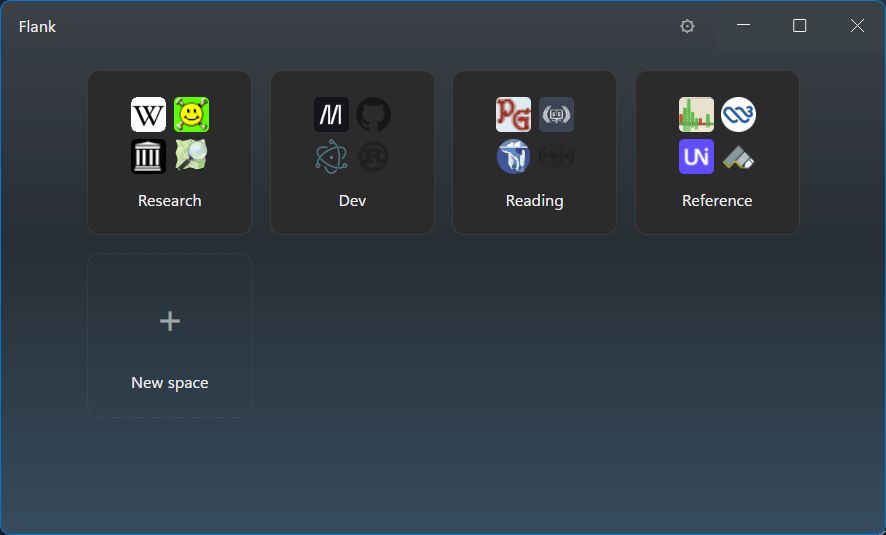

# Flank

A personal, space-oriented web browser: no tabs, no persistent address bar.
Instead of one window full of tabs, the browser is a set of **spaces**, each
opening as its own window with its own home grid of pinned links, its own
session, and up to two side-by-side page views. Cross-platform
(Windows/macOS/Linux), built with Electron, TypeScript, and React.

[`docs/`](docs) is the specification — start at
[`docs/overview.md`](docs/overview.md); `docs/architecture.md` covers how it
is built.

## A look at it



The page you launch stays put. Follow a link out of it and the second section
opens beside it, so the thing you were reading is never replaced. Each
section's chrome takes its page's colors, and an address bar appears only over
a page that isn't one of the space's pinned links — the left has none, the
right does.



Every space opens on its own home grid — pinned links and a search box, with no
browser chrome until a page needs it. Each link keeps its page alive in the
background, so going home and coming back resumes exactly where you were.



The Manager is the launcher: one tile per space, each showing the favicons of
what's pinned inside it.

## Develop

```powershell
npm install
npm run dev        # build + launch with HMR for the chrome UI
```

Main-process or preload changes restart the app; chrome UI (React) changes
hot-reload in place.

- **App data**: `%APPDATA%\Flank-Electron` (or the platform equivalent of
  Electron `userData`) — `settings.json`, `spaces.json`, `sessions/`,
  `icons/`, `debug.log`, plus the shared Chromium profile.
- **Diagnostics**: `debug.log` in the data folder collects errors and
  fire-and-forget failures — check it first when something silently does
  nothing.
- **Remote debugging**: set `FLANK_DEBUG_PORT=9223` before launching to expose
  the Chromium DevTools protocol for every view (chrome UI and pages), e.g.
  `http://127.0.0.1:9223/json`.
- **Throwaway profile**: `FLANK_DATA_DIR` points the whole data folder
  somewhere else, so a demo or an experiment never touches real spaces.

```powershell
$env:FLANK_DEBUG_PORT="9223"; npm run dev
```

### Screenshots

The images above are reproducible rather than hand-staged.
[`tools/demo-profile/`](tools/demo-profile) holds a settings/spaces fixture of
public, ad-free sites with window sizes chosen to frame well; copy it to a
temporary folder, point `FLANK_DATA_DIR` at that folder, and the app starts as
the demo rather than as yours. Favicons and the Chromium profile fill in on
first run, so the fixture stays two JSON files.

```powershell
$demo = Join-Path $env:TEMP 'flank-demo-profile'
New-Item -ItemType Directory -Path $demo -Force | Out-Null
Copy-Item tools\demo-profile\*.json $demo -Force
$env:FLANK_DATA_DIR = $demo; $env:FLANK_DEBUG_PORT = '9223'; npm run dev
```

[`tools/capture-window.ps1`](tools/capture-window.ps1) then captures one
window to a PNG. It runs DPI-aware (a scaled display would otherwise yield a
blurry upscale), takes the DWM frame bounds so the invisible resize border is
excluded, and masks the rounded corners to transparency:

```powershell
.\tools\capture-window.ps1 -TitleLike 'Research' -Out docs\images\home.png
```

Window capture is the only option here: a space window composites a chrome
view over separate `WebContentsView`s, so `capturePage()` inside the app can
only ever photograph one layer of the stack. With `FLANK_DEBUG_PORT` set, the
views can be posed first — `window.flank.invoke('section:openLink', …)` over
the DevTools protocol opens pages without clicking through the UI.

## Checks

```powershell
npm run typecheck   # main/preload (node) + renderer (web)
```

## Package

```powershell
npm run package     # electron-vite build + electron-builder → dist/
```

Produces `dist/Flank-<version>-win.zip` on Windows (unzip anywhere and run
`Flank.exe` — there is no installer), and zip/tar.gz equivalents when run on
macOS/Linux.

The Linux tar.gz can also be cross-packaged from any OS — electron-builder
downloads the target platform's Electron binary:

```powershell
npm run build; npx electron-builder --linux   # → dist/flank-<version>.tar.gz
```

macOS **cannot** be cross-packaged: the `.app` bundle contains symlinks that
non-Mac filesystems lose, and the ad-hoc `codesign` step (without which
Apple Silicon refuses to launch the app) only exists on macOS. Build on a
Mac — or a macOS CI runner:

```bash
npm install
npm run build && npx electron-builder --mac   # → dist/Flank-<version>[-arm64]-mac.zip
```

This yields one zip per configured arch (arm64 for Apple Silicon, x64 for
Intel), ad-hoc signed automatically since no signing identity is configured.

On Linux, extract and run `./flank`. Electron bundles Chromium, so no
runtime needs installing; on kernels without unprivileged user namespaces the
bundled `chrome-sandbox` helper must be made setuid root
(`chown root:root chrome-sandbox && chmod 4755 chrome-sandbox`). macOS zips
are not notarized, so Gatekeeper blocks the first launch of the downloaded
app: approve it under System Settings → Privacy & Security → "Open Anyway"
(older macOS accepts right-click → Open). Copies built on the Mac itself
launch without ceremony.

Three Linux specifics, the first two handled by the app since there is no
installer:

- **Desktop entry.** On each start the packaged app writes
  `~/.local/share/applications/flank.desktop` and its icon into the user's
  icon theme, re-pointing them if the folder moved. This is what gives the
  dock, app grid, and window switcher a real icon: desktop environments pair
  a window to its launcher by matching the window's `app_id`/`WM_CLASS`
  against the entry's base name (`flank`, set via `desktopName` in
  `package.json`), and read the icon from there.
- **Display server.** Flank runs on whatever the session provides: native
  Wayland under Wayland, X11 under X11. Wayland's protocol forbids an app from
  placing its own windows, so there window positions are not restored (sizes
  are) and extension popups are placed by the compositor rather than anchored
  to their sidebar button. `ELECTRON_OZONE_PLATFORM_HINT=x11` asks Electron
  for XWayland, which brings both back where the build and session honor it.
  Do not set `--ozone-platform` from the main process instead: the browser
  process has already picked its backend, so only the child processes switch,
  and the resulting window never paints — see `docs/architecture.md`.
- **Screen sharing.** Under Wayland this runs through xdg-desktop-portal, so
  the session needs a portal backend implementing ScreenCast — the GTK
  backend alone does not, and a session without one ("Can't share your
  screen" in Meet, and the same in any other browser) needs the one for its
  desktop installed: `xdg-desktop-portal-gnome` under GNOME,
  `-kde` under KDE, `-wlr` under wlroots compositors. Switching to XWayland
  is not a workaround: an XWayland client cannot see Wayland windows' pixels,
  so it captures a mostly blank screen.

`debug.log` records the session and what follows from it, e.g.
`Linux session: XDG_SESSION_TYPE=wayland ozone=session default
positioning=unavailable (native Wayland)`.

## Layout

```
src/main/      lifecycle, stores, window/view management, routing, favicons,
               permissions, downloads, extensions
src/preload/   chrome.ts (UI IPC bridge), content.ts (page instrumentation)
src/renderer/  React chrome UI: manager/ (grid, settings), space/ (sections,
               home, web chrome, flyouts, find bar), components/
src/shared/    data model + IPC DTO types shared across processes
```

## License

Copyright (C) 2026 Peter Woodman. Flank is free software under the
[GNU General Public License](LICENSE), version 3 or later.

The copyleft is inherited rather than chosen: Flank's extension support uses
[`electron-chrome-extensions`](https://github.com/samuelmaddock/electron-browser-shell),
which is offered under either the GPL-3.0 or a paid patron license, and Flank
takes the GPL option.
